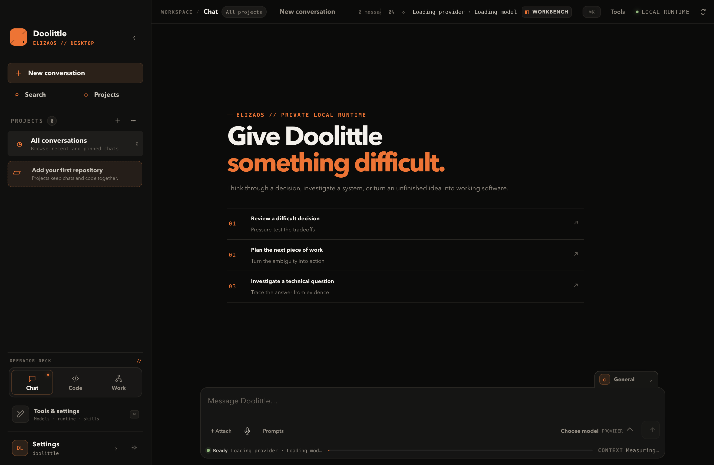
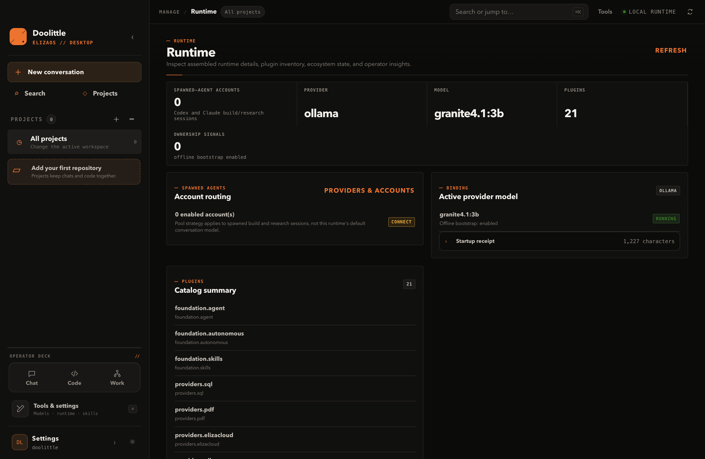

<p align="center">
  
</p>

<h1 align="center">Doolittle</h1>

<p align="center">
  <strong>An ElizaOS-native, local-first agent for terminal and desktop work.</strong><br />
  One runtime for conversational work, code and research tasks, gateway operations, and an inspectable operator console.
</p>

<p align="center">
  <a href="#quick-start">Quick start</a> ·
  <a href="#what-is-in-the-runtime">Capabilities</a> ·
  <a href="#architecture-and-ownership">Architecture</a> ·
  <a href="docs/README.md">Documentation</a> ·
  <a href="CONTRIBUTING.md">Contributing</a> ·
  <a href="CODE_OF_CONDUCT.md">Code of Conduct</a>
</p>

<p align="center">
  <a href="https://github.com/SYMBaiEX/doolittle/actions/workflows/ci.yml"></a>
  <a href="LICENSE"></a>
  <a href="https://github.com/SYMBaiEX/doolittle/releases"></a>
  <a href="https://github.com/elizaos/eliza"></a>
</p>



> **Alpha software.** Doolittle is built on the ElizaOS 2.0 beta train. Its runtime reports unavailable or degraded integrations instead of presenting them as ready.

## Why Doolittle

Doolittle is for work that needs more than a one-shot chat: inspect a repository, reason through a decision, run a bounded coding task, delegate research, or operate connected local services. The plain CLI, fullscreen cockpit, HTTP API, gateway, and Electron app all use the same assembled ElizaOS runtime and progress contract.

- **Terminal first:** a conversational CLI with slash commands, explicit shell shortcuts, approvals, run progress, and one-shot commands.
- **Desktop when it helps:** an Electron + React operator console for chat, projects, code, work, sessions, providers, tools, skills, logs, and diagnostics.
- **Local-first by default:** the API binds to `127.0.0.1`; the desktop talks to a private loopback runtime through a context-isolated preload bridge.
- **Provider-aware:** local Ollama is the default no-key path. Eliza Cloud, OpenAI, Anthropic, Codex, Claude Code, and other installed providers are configured through setup and runtime readiness.
- **Truthful orchestration:** official Eliza task orchestration handles delegation. Doolittle supplies the product bridge for workspace tools and account routing, and records unavailable states rather than inventing results.

## Quick start

### Source install (macOS, Linux, or WSL)

Clone the repository, then run the installer from its root:

```bash
git clone https://github.com/SYMBaiEX/doolittle.git
cd doolittle
bash scripts/install.sh
```

The installer requires the Node version in [`.node-version`](.node-version), installs the pinned Nub toolchain and workspace dependencies, installs Electron's runtime, links `doolittle` into `~/.local/bin`, and opens onboarding. It writes local configuration such as `.env` and `.doolittle/`; do not commit either.

For the default local model path, run Ollama and pull the configured models before your first live prompt:

```bash
ollama pull granite4.1:3b
ollama pull nomic-embed-text:latest
ollama serve
```

Open a new terminal if the installer updated your PATH, then:

```bash
doolittle
```

Inside the shell, start with:

```text
/status
/doctor
/runtime status
```

Use `bash scripts/install.sh --check` for a non-mutating install receipt, `--headless` for non-interactive setup, or `--desktop` to bootstrap and launch the desktop path. The complete first-run guide is in [docs/quickstart.md](docs/quickstart.md).

### Desktop

From a source checkout:

```bash
doolittle desktop
```

For development:

```bash
nub install --frozen-lockfile --ignore-scripts
nub run desktop:runtime:install
nub run desktop:dev
```

Dependency lifecycle scripts are disabled deliberately; Doolittle installs the
trusted Electron runtime explicitly instead of executing transitive package
scripts during workspace installation.

Tagged releases build platform installers; Windows uses a per-user x64 NSIS installer. See [desktop installation and packaging](docs/desktop.md) for platform-specific details. The packaged desktop includes its runtime and does not require Nub, Node.js, or a source checkout after installation.



*A real local, offline-bootstrap desktop run. The Runtime page makes provider, model, plugin, and account-pool state visible rather than assuming they are configured.*

## Everyday commands

| Goal | Command |
| --- | --- |
| Start the conversational shell | `doolittle` or `doolittle plain` |
| Open the fullscreen terminal cockpit | `doolittle cockpit` |
| Launch the desktop app | `doolittle desktop` |
| Check runtime readiness | `doolittle status` or `/status` |
| Inspect tools and skills | `doolittle tools`, `doolittle skills` |
| Inspect native assembly | `doolittle runtime` or `/runtime status` |
| Execute one bounded prompt | `doolittle exec -p "summarize this repo"` |
| Run the local API | `doolittle api` |
| Operate transports | `doolittle gateway` |
| Reconfigure or diagnose | `doolittle setup`, `doolittle doctor` |

The API is also useful for a local script or another UI:

```bash
doolittle api
curl http://127.0.0.1:3000/health
curl http://127.0.0.1:3000/runtime/status
```

The API's runtime-owned routes come from Eliza first; Doolittle-specific REST adapters fill the product gaps. Refer to [the quickstart](docs/quickstart.md) for the current endpoint list.

## What is in the runtime

| Area | What Doolittle provides | Important boundary |
| --- | --- | --- |
| Conversation and progress | Multi-step message handling, approvals, events, transcripts, run depth, and terminal/desktop status | Natural-language turns go through ElizaOS `messageService.handleMessage(...)`; Doolittle does not maintain a competing intent pipeline. |
| Code and workspace work | Repository inspection, file/search/patch/terminal surfaces, ACP workers, and operator UI | Coding delegation is owned by the official Eliza orchestrator; Doolittle owns its workspace-facing product tools. |
| Research | Explicit research task path, durable receipts, and cited-report workflow | Live research needs a configured `RESEARCH` model. A missing model produces a clear unavailable result. |
| MCP tools and resources | Multi-server status, discovered tools, marketplace lookup, and terminal/desktop inspection | Official `@elizaos/plugin-mcp` owns validation, stdio/HTTP/SSE transports, retries, provider context, resources, and invocation. Doolittle only projects the operator UX. |
| Providers and accounts | Local Ollama, official Eliza Codex and Eliza Cloud providers, plus Doolittle's Claude Code and Devin bridges | Codex and Claude account pools use Eliza's account-store and selector bridge. Tokens are not returned to the API or renderer. |
| Desktop and API | Electron lifecycle, context-isolated IPC, React presentation, loopback API, sessions and diagnostics | Official `@elizaos/ui` `ElizaClient` owns ordinary request/error semantics; Electron owns native process capabilities and a strict transport allowlist; the API remains authoritative for runtime behavior and durable state. |
| Skills, gateway, and operations | Curated skills, configured messaging adapters, scheduling and local diagnostics | Availability depends on installed plugins and configuration; inspect `/doctor`, `/runtime status`, or the desktop Runtime view. |

### Providers and models

Ollama is the local-first default. Setup can also select supported Eliza Cloud, OpenAI, Anthropic, Codex, Claude Code, or other installed provider routes. Provider packages are not a promise that credentials or a live service are available—Doolittle exposes readiness so operators can see the difference.

For pooled Codex and Claude Code coding sessions, Doolittle keeps separate account records in Eliza's account store and lets the official selector choose an eligible account. It injects the selected credential only into the spawned first-party subprocess, while the desktop and API receive secret-free health and usage projections. See [capability truth](docs/capability-truth.md) for the exact contract.

### Research and coding

Research and coding are deliberately different paths. Research runs through `ModelType.RESEARCH` with a per-run abort signal and a durable cancellation receipt; provider-side interruption activates with Eliza releases that support `ResearchParams.signal`, while the durable guard remains authoritative on beta.7. Coding remains an ACP worker path with Doolittle workspace tools. The `autocoder` surface is **experimental**: planning-only operations return `executed=false` and must not be treated as autonomous file mutation.

## Architecture and ownership

```text
CLI / Cockpit / Desktop / Gateway / local HTTP API
                     │
                     ▼
          Doolittle application (packages/agent)
          runtime assembly, product services, UI contracts
                     │
      ┌──────────────┼──────────────┐
      ▼              ▼              ▼
 ElizaOS core   Official plugins   Doolittle bridges
 message/task   Ollama, OpenAI,    Claude Code, Devin,
 lifecycle      Anthropic, Codex,  workspace and gateway
                Eliza Cloud, MCP,  policy, planning, and
                Telegram, agent    operator experience
                orchestrator
```

This separation is intentional. Doolittle uses ElizaOS SDK primitives for message lifecycle, tasks, providers, and plugins. Where the SDK does not define the product experience, Doolittle owns the bridge and documents it as such. The full workspace map is in [docs/monorepo.md](docs/monorepo.md); the generated inventory identifies each runtime component's package, owner, maturity, and test coverage in [docs/plugin-inventory.md](docs/plugin-inventory.md).

## Project layout

```text
apps/desktop/          Electron main/preload and React renderer
packages/agent/        Doolittle runtime, CLI, API, gateway, services
packages/plugins/      Provider bridges and consolidated product plugin
packages/skills/       Curated and generated skill content
packages/acp/          Agent Communication Protocol support
packages/contracts/    Shared contracts
docs/                  Operator, desktop, capability, and architecture guides
scripts/               Bootstrap, verification, and release helpers
```

## Development and verification

This is a Nub workspace. After `nub install --frozen-lockfile --ignore-scripts`,
use the narrowest relevant command while working, then run the appropriate
gates before opening a change:

```bash
nub run typecheck          # TypeScript, no emit
nub run test               # Vitest suite
nub run build              # packages/agent bundle
nub run lint:check         # Biome check
nub run desktop:typecheck  # desktop main, preload, renderer
nub run desktop:test       # focused desktop tests
nub run test:e2e           # real Electron + Playwright smoke
nub run check:acceptance   # hygiene, boundaries, SDK, docs, links, audit
```

`nub run check` combines linting, typechecking, tests, and the agent build. CI additionally runs the Electron smoke test and acceptance gates; see [the CI workflow](.github/workflows/ci.yml).

### Provider package release

Provider publishing is explicit and opt-in. Validate the linked packages and dry-run their publish contracts locally. Live publishing is restricted to the protected GitHub Actions OIDC workflow; the CLI does not accept publishing credentials.

```bash
nub run smoke:linked-providers                              # validate all providers
nub run publish:providers:check                             # verify publish readiness
nub run publish:providers -- --provider all                 # dry-run all publish contracts
nub run publish:providers:alpha                             # dry-run alpha publish contract
```

## Security and privacy

Doolittle is designed to keep its default operating boundary local:

- The HTTP API binds to `127.0.0.1` by default. A non-loopback bind requires `ELIZA_API_TOKEN`.
- The desktop renderer has no direct Node.js or filesystem access; privileged work is constrained to its preload IPC contract.
- Workspace context and tool inputs are scanned before model use. Treat `.env`, the Doolittle data directory, and any workspace credentials as sensitive.
- Use approval controls and inspect run receipts before accepting commands that affect your machine or repository.

Please report vulnerabilities privately—do not open a public issue for an unpatched problem. Full reporting instructions and operator hardening guidance are in [SECURITY.md](SECURITY.md).

## Contributing

Issues, focused pull requests, documentation corrections, and test improvements are welcome. Please read [CONTRIBUTING.md](CONTRIBUTING.md) and the [Code of Conduct](CODE_OF_CONDUCT.md) before starting: they cover the pinned toolchain, workspace boundaries, collaboration expectations, and required checks. Keep claims tied to observable behavior; update tests and generated truth docs when a runtime contract changes.

Useful references:

- [Documentation index](docs/README.md)
- [Quickstart](docs/quickstart.md)
- [Desktop architecture and packaging](docs/desktop.md)
- [Capability truth and degraded modes](docs/capability-truth.md)
- [Plugin inventory](docs/plugin-inventory.md)
- [Package ownership and Eliza migration status](docs/package-ownership.md)
- [Operator loop](docs/operator-loop.md)
- [Changelog](CHANGELOG.md)

## License

Distributed under the [MIT License](LICENSE).
